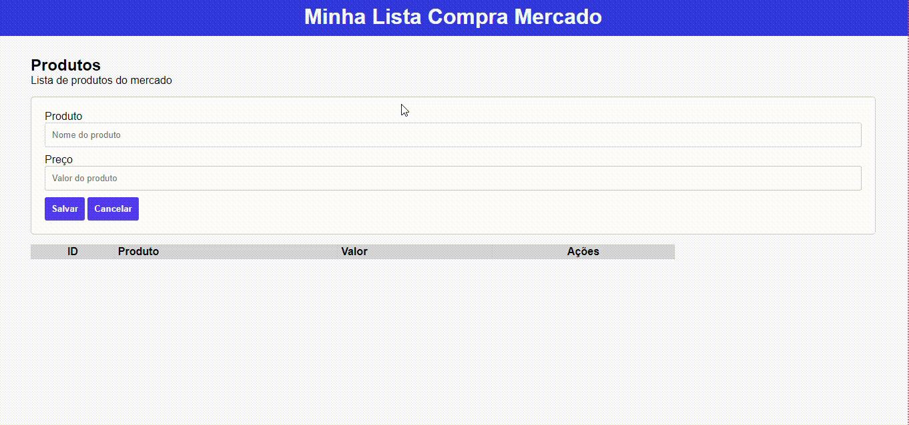

# Projeto lista

## Trabalho-Lista

Com base no exercício feito em sala com prof Leo, com utilização de Array, onde criamos um sistema que armazena um nome no Array e permite ainda realizar as operações de edição e exclusão, você deve propor um problema que pode ser resolvido com base na mesma proposta de sistema.

## Descrição
Este código HTML permite adicionar e gerenciar pordutos. A página possui um cabeçario com o título da lista e uma seção principal que inclui um formulário para adicionar novos itens e uma tabela que mostra os itens adicionados. Cada linha da tabela inclui um ID único, o nome do produto, o preço e botões para editar ou excluir um item. O formulário inclui campos para digitar o nome e o preço do produto e botões para salvar ou cancelar a adição de um item. A página também inclui um arquivo de estilo e um script em JavaScript para manipular a lista de compras. O script lida com as operações de adicionar, excluir e editar itens na lista. O código HTML é construído utilizando classes CSS para organizar e apresentar os elementos na página.

## Funcionalidades

- Adicionar novos itens à lista, inserindo o nome do produto e o preço em um formulário e clicando no botão "Salvar".
- Cancelar a adição de um novo item, clicando no botão "Cancelar".
- Excluir itens da lista, clicando no botão "Excluir" correspondente à linha do item na tabela.
- Editar itens da lista ao clicar no botão "Editar", que preenche o formulário com o nome e o preço do item selecionado na tabela, possibilitando sua atualização.
- Visualizar a lista de produtos do mercado numa tabela que exibe um ID único para cada produto, o nome do produto, o preço e botões para edição e exclusão.

### Tecnologias utilizadas

- HTML: para estruturar e organizar os elementos da página;
- CSS: para estilizar a página;
- JavaScript: para adicionar interatividade e controlar a lógica da aplicação através do arquivo "controller.js";

## Autores

[Talyta](https://github.com/poxxataly26/portfolio-pessoal)

